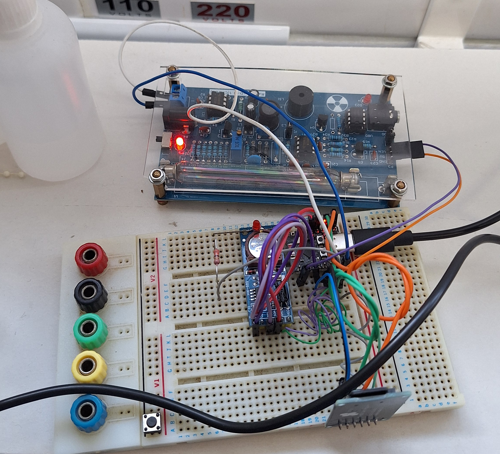
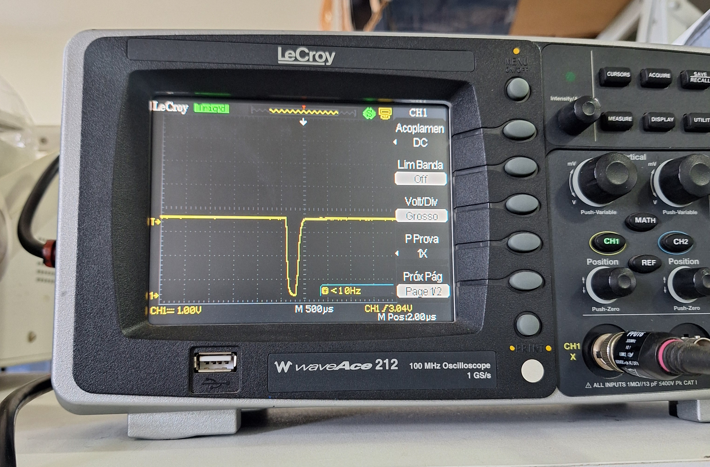
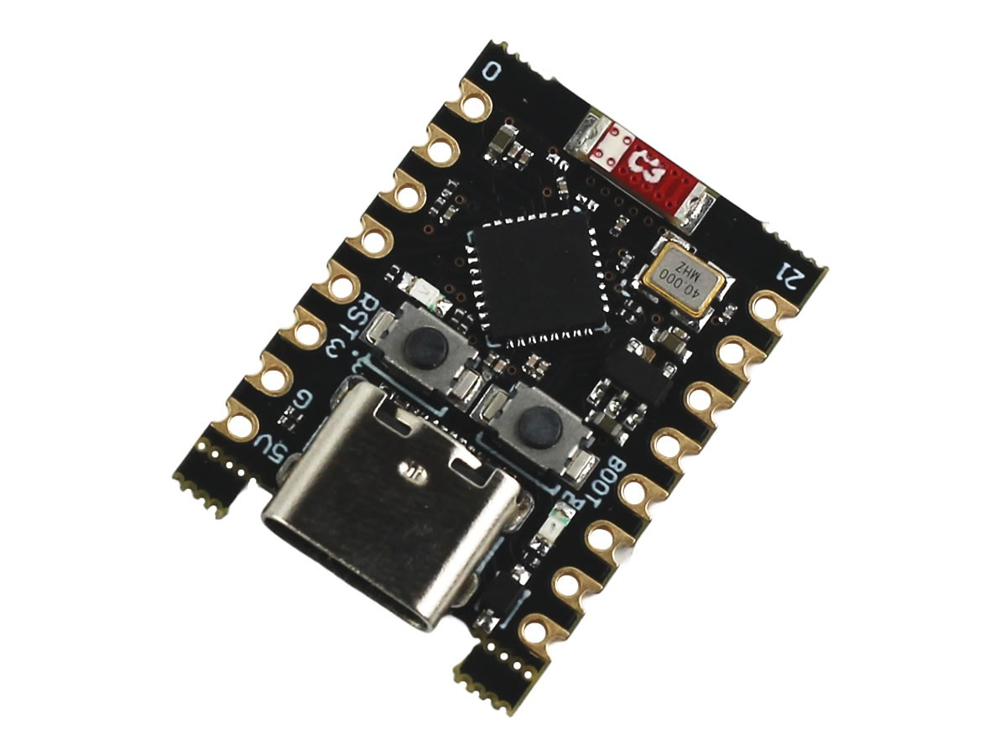
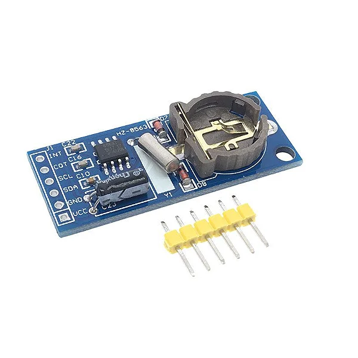
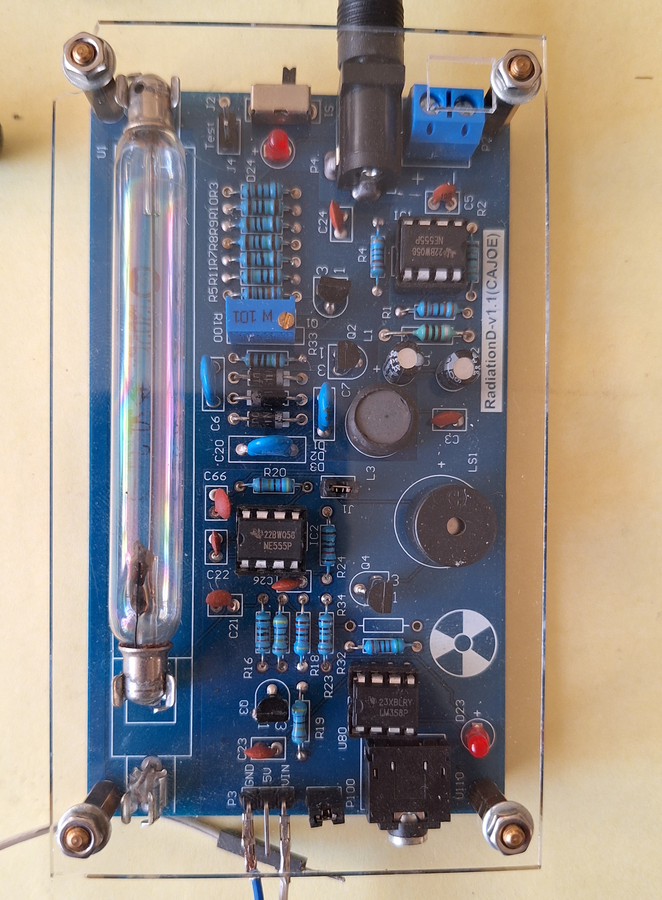
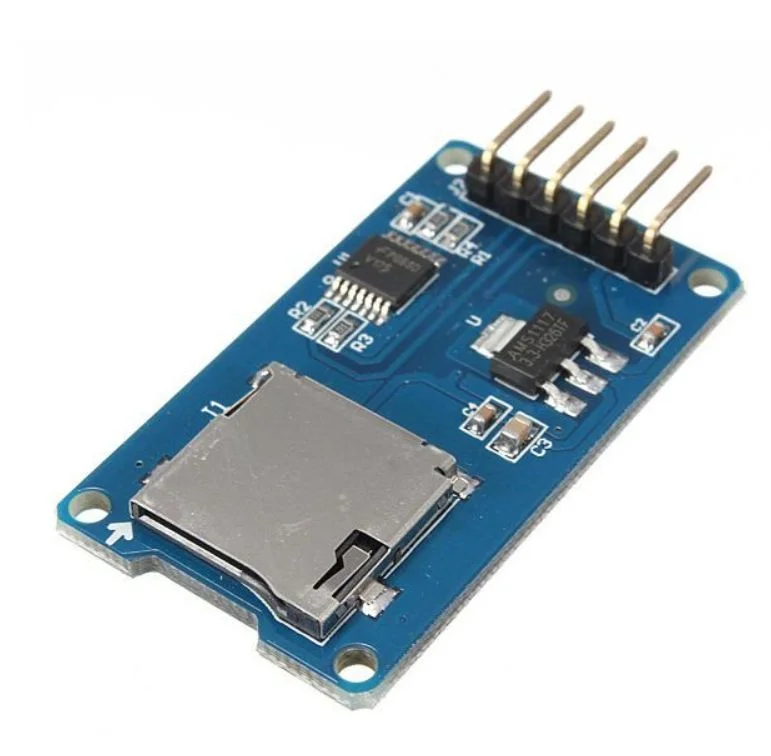

# 📟 Monitor de Radiação com ESP32-C3 + PCF8563 + SD Card

Este projeto implementa um **monitor de radiação** para o **Detector Geiger RadiationD-v1.1(CAJOE)**, um **RTC PCF8563** e um **ESP32-C3**.  
Os dados coletados são armazenados em um **cartão SD** no formato CSV, organizados por dia e hora.

  

O sistema é capaz de:
- Contar pulsos provenientes do detector Geiger em tempo real.
- Acordar a cada hora via interrupção do alarme do **RTC PCF8563**.
- Registrar a contagem horária em um arquivo CSV no cartão SD.
- Sincronizar a hora do RTC via **NTP (Wi-Fi)** quando necessário.
- Indicar funcionamento através de um **LED heartbeat**.
- Proteger contra travamentos com **Watchdog Timer (WDT)**.

### Pulso típico de um Detector Geiger
 

    

 
A medida acima mostra o pulso negativo característico gerado pelo tubo Geiger-Müller ao detectar uma partícula.
O sistema monitora a borda de descida desse pulso, garantindo a detecção precisa de eventos de radiação.

---

## 🚀 Funcionalidades
- 📡 **Contagem de pulsos** via interrupção no pino conectado ao tubo Geiger.
- ⏰ **Alarme RTC por hora** (desperta o sistema e grava os dados).
- 💾 **Armazenamento em cartão SD** no formato CSV (1 arquivo por dia).
- 🌐 **Sincronização inicial via NTP** (se RTC estiver sem hora válida).
- 🔴 **LED heartbeat** indicando que o sistema está ativo.
- 🛡️ **Watchdog Timer** para reinicialização automática em caso de travamento.

---

## 📂 Estrutura dos arquivos CSV
Os dados são salvos em arquivos nomeados de acordo com a data:  
**/dados_YYYYMMDD.csv**

Cada linha do arquivo contém:
**hh:mm:ss > [pulsos_última_hora] => {H0,H1,H2,...,H23}**

Exemplo:
**12:00:00 > [153] => {0,45,67,153,0,0,...}**

---

## 🖼️ Componentes do projeto

- ESP32-C3  
  

- Módulo RTC PCF8563  
  

- Detector Geiger  
  

- Módulo SD Card (SPI)  
  

---

## 🔌 Ligações principais
| Componente   | ESP32-C3 GPIO |
|--------------|---------------|
| RTC SDA      | GPIO 8        |
| RTC SCL      | GPIO 9        |
| RTC INT      | GPIO 3        |
| Geiger OUT   | GPIO 0        |
| SD CS        | GPIO 2        |
| SD MISO      | GPIO 5        |
| SD MOSI      | GPIO 6        |
| SD SCK       | GPIO 4        |
| LED Heartbeat| GPIO 10       |

---

## 📋 Fluxo de funcionamento
1. No primeiro boot, o ESP32 conecta ao Wi-Fi e sincroniza o RTC com um servidor NTP.  
2. O RTC dispara um alarme **a cada hora cheia**.  
3. O ESP32 registra a contagem acumulada daquela hora no **cartão SD**.  
4. O vetor de 24 horas é atualizado e escrito junto no CSV.  
5. O LED pisca a cada segundo como indicação de funcionamento.  
6. O WDT reinicia o sistema em caso de travamento.  

---

## 🛠️ Melhorias planejadas
- Implementar **Deep Sleep** para economia de energia, que já está sendo trabalhado.  
- Envio dos dados para um servidor remoto (MQTT/HTTP).  
